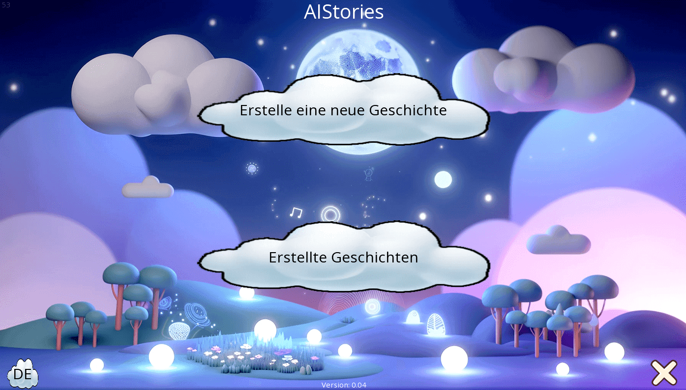
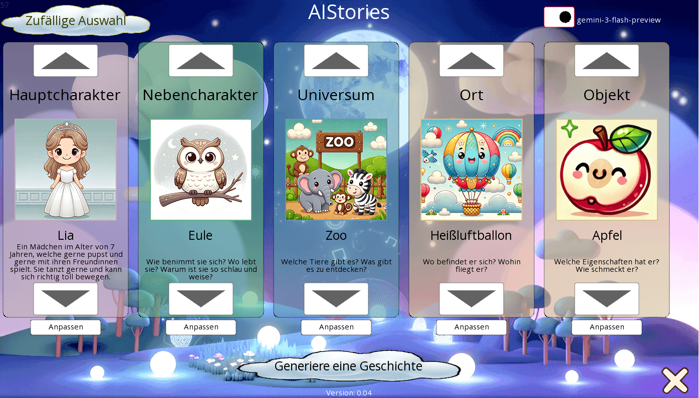
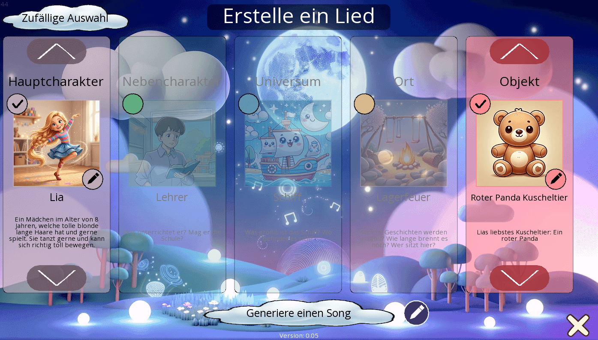
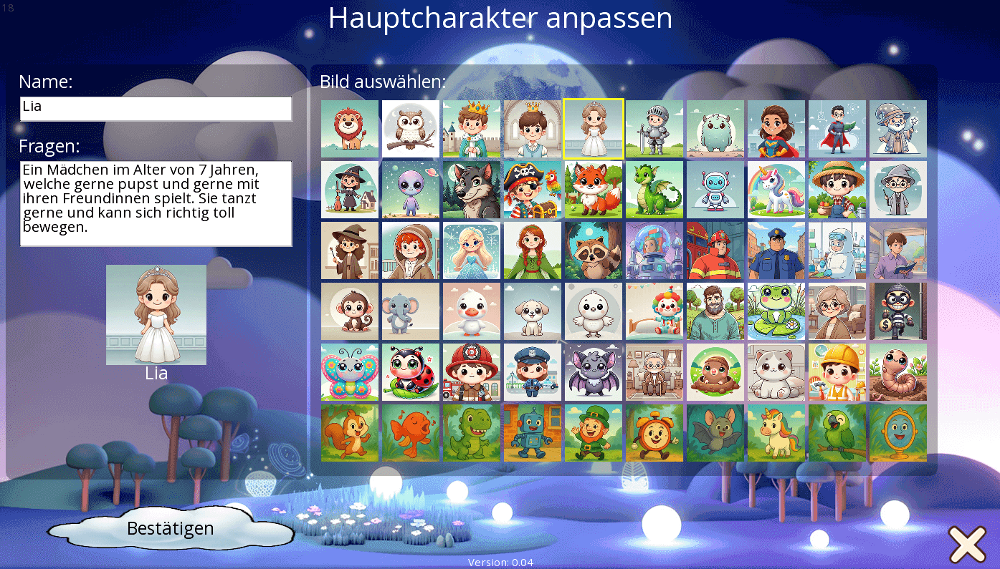
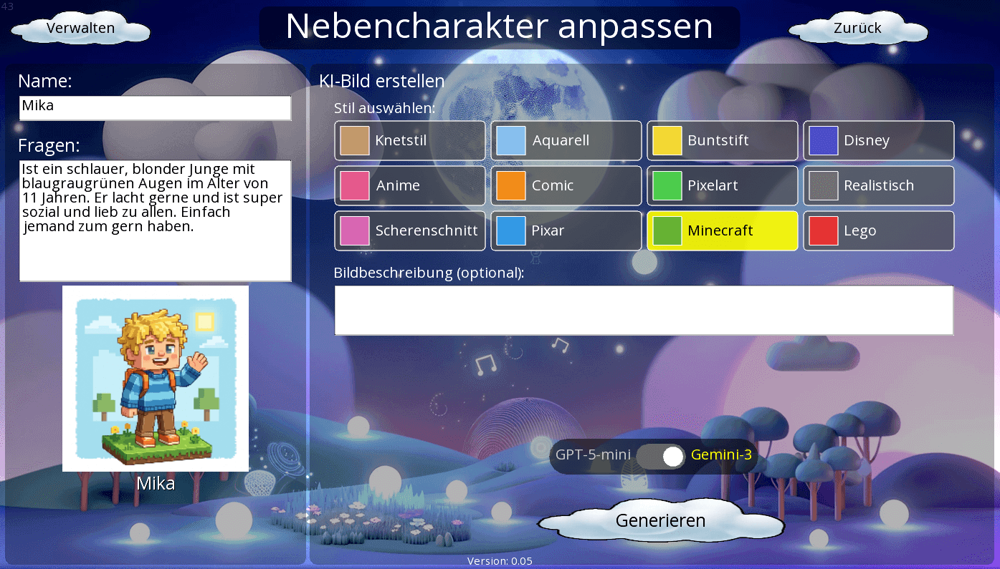
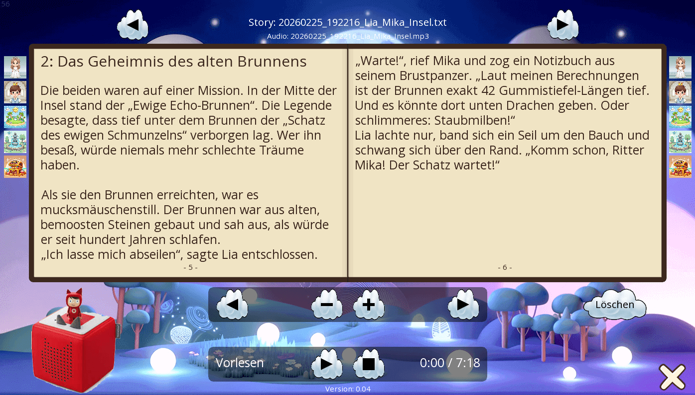
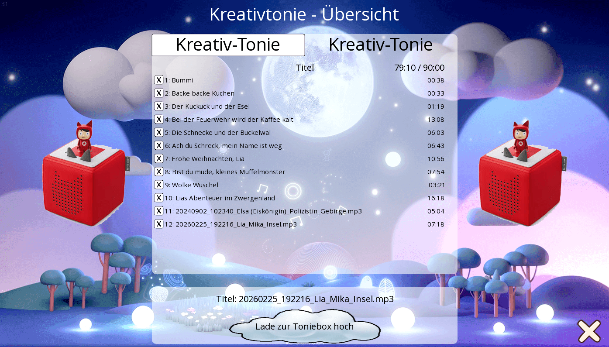

# AIStories

A cross-platform app that lets children create their own bedtime stories — and now songs too! Pick characters, worlds, and themes, then let an AI bring them to life as a unique story or a catchy song. Make it truly yours with custom characters, AI-generated artwork in 12 different styles, and fine-tuned settings for age, genre, and complexity.

No API keys required to get started — children can pick story elements and write their own stories right away.

With optional API keys you unlock more magic, step by step:

- **ChatGPT or Gemini API Key** — The AI generates unique stories and creates custom artwork for your characters in 12 different styles
- **+ ElevenLabs API Key** — The story is read aloud with a configurable voice, with real-time word highlighting as you listen
- **+ Tonies Cloud Login** — Upload the audio directly to your Creative Tonie figure
- **+ Suno API Key** — Generate original songs with lyrics, melodies, and multiple music styles

## Features

### Stories
- **AI-Powered Story Generation** — Generate unique children's stories using OpenAI (GPT-5-mini) or Google Gemini
- **5 Story Elements** — Pick from 30+ options each for Main Character, Supporting Character, Universe, Place, and Object
- **5 Story Types** — Bedtime stories, friendship tales, detective mysteries, adventure quests, or classic fairy tales
- **Text-to-Speech** — Convert stories to audio via ElevenLabs with configurable voice and model
- **Tonie.box Integration** — Upload generated audio directly to a Creative Tonie
- **Beautiful Book View** — Read stories in a handcrafted book layout with page-turning animations and word-by-word highlighting during playback

### Songs
- **AI-Powered Song Creation** — Generate original songs with lyrics and melody via Suno API
- **8 Music Styles** — Pop, Rock, Country, HipHop, Lullaby, Folk, Electronic, Musical
- **2 Versions per Song** — Every song is generated in two variations so you can pick your favorite
- **Age-Appropriate Lyrics** — From simple lullabies with sound effects for babies to emotionally complex songs for teens

### Make It Yours
- **Custom Characters & Objects** — Create your own entries with name, description, and image
- **AI Image Generation** — Generate unique artwork for your characters in 12 styles: Clay, Watercolor, Crayon, Disney, Anime, Comic, Pixel Art, Realistic, Papercut, Pixar, Minecraft, Lego
- **Toggle Story Elements** — Enable or disable individual columns to control exactly what goes into your story or song
- **Fine-Tune Settings** — Adjust age group (baby to adult), story length, complexity, and even edit the AI prompt directly
- **Works Without API Keys** — Children can pick story elements, get creative, and write their own stories

### General
- **Multi-Language UI** — Available in: DE Deutsch, GB English, FR Francais, ES Espanol, IT Italiano, TR Turkce
- **Cross-Platform** — Runs on Desktop (Windows, macOS, Linux) and Android

## Screenshots

<p>
  <a href="screenshots/aiStories_1.png"></a>
  <a href="screenshots/aiStories_3.png"></a>
  <a href="screenshots/aiStories_7.png"></a>
  <a href="screenshots/aiStories_2.png"></a>
  <a href="screenshots/aiStories_6.png"></a>
  <a href="screenshots/aiStories_4.png"></a>
  <a href="screenshots/aiStories_5.png"></a>
</p>

## Prerequisites

- **Java 8** or higher
- **Android SDK** (API 27+) for Android builds
- API keys are **optional** — see [Configuration](#configuration) for details

## Getting Started

### 1. Clone the repository

```bash
git clone https://github.com/TheApo/aiStories.git
cd aiStories
```

### 2. Configuration

All API keys are optional. Add only the ones for the features you want to use:

```bash
cp assets/config.properties.sample assets/config.properties
```

Edit `assets/config.properties`:

```properties
CHATGPT_API_KEY=your-openai-api-key
GEMINI_API_KEY=your-gemini-api-key
ELEVENLABS_API_KEY=your-elevenlabs-api-key
ELEVENLABS_VOICE_ID=your-elevenlabs-voice-id
ELEVENLABS_MODEL_ID=eleven_multilingual_v2
TONIES_USERNAME=your-tonies-username
TONIES_PASSWORD=your-tonies-password
SUNO_API_KEY=your-suno-api-key
```

| Key | Required | Description |
|-----|----------|-------------|
| `CHATGPT_API_KEY` | For OpenAI stories | [OpenAI API Key](https://platform.openai.com/api-keys) |
| `GEMINI_API_KEY` | For Gemini stories | [Google AI Studio API Key](https://aistudio.google.com/apikey) |
| `ELEVENLABS_API_KEY` | For TTS | [ElevenLabs API Key](https://elevenlabs.io/) |
| `ELEVENLABS_VOICE_ID` | For TTS | Voice ID from your ElevenLabs account |
| `ELEVENLABS_MODEL_ID` | No (default: `eleven_multilingual_v2`) | ElevenLabs TTS model |
| `TONIES_USERNAME` | For Tonie upload | Tonies Cloud login email |
| `TONIES_PASSWORD` | For Tonie upload | Tonies Cloud login password |
| `SUNO_API_KEY` | For song generation | [Suno API Key](https://sunoapi.org/) |

> **Note:** `config.properties` is in `.gitignore` and will not be committed. Never share your API keys.

### 3. Build & Run

**Desktop:**

```bash
./gradlew :desktop:run
```

**Android:**

```bash
./gradlew :android:installDebug
```

**Build Desktop JAR:**

```bash
./gradlew :desktop:dist
```

The JAR will be created in `desktop/build/libs/`.

## Tech Stack

- [LibGDX](https://libgdx.com/) 1.13.1 — Cross-platform game framework
- [Gson](https://github.com/google/gson) — JSON serialization
- [OkHttp](https://square.github.io/okhttp/) — HTTP client
- [Lombok](https://projectlombok.org/) — Boilerplate reduction
- [toniebox-api](https://github.com/maximilianvoss/toniebox-api) — Tonie.box cloud connection (Apache License 2.0)
- [ElevenLabs API](https://elevenlabs.io/) — Text-to-Speech
- [OpenAI API](https://platform.openai.com/) — Story generation & image generation (GPT-5-mini, gpt-image-1-mini)
- [Google Gemini API](https://ai.google.dev/) — Story generation & image generation (Gemini)
- [Suno API](https://sunoapi.org/) — Song generation with lyrics and melody

## Project Structure

```
AIStories/
├── core/           # Shared game logic (stories, songs, UI, entities)
├── desktop/        # Desktop launcher (LWJGL3)
├── android/        # Android launcher
├── assets/         # Images, fonts, translations, config
│   ├── config.properties.sample
│   ├── i18n/       # Localization files (6 languages)
│   └── images/     # Sprite sheets and textures
├── data/           # Generated story and song files
└── save/           # Save data
```

## License

This project is licensed under the MIT License — see the [LICENSE](LICENSE) file for details.

### Third-Party Licenses

This project uses [toniebox-api](https://github.com/maximilianvoss/toniebox-api) by Maximilian Voss, licensed under the [Apache License 2.0](https://www.apache.org/licenses/LICENSE-2.0).
